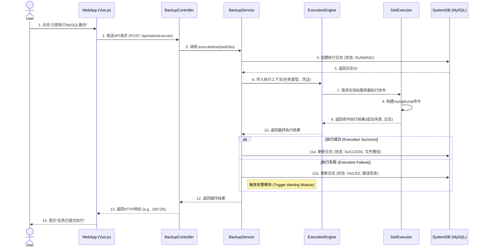

```mermaid
sequenceDiagram
actor User
participant WebApp (Vue.js)
participant BackupController
participant BackupService
participant ExecutionEngine
participant SshExecutor
participant SystemDB (MySQL)

    User->>WebApp (Vue.js): 1. 点击“立即执行MySQL备份”
    WebApp (Vue.js)->>BackupController: 2. 发送API请求 (POST /api/tasks/execute)
    BackupController->>BackupService: 3. 调用 executeNow(taskDto)

    BackupService->>SystemDB (MySQL): 4. 创建执行日志 (状态: RUNNING)
    SystemDB (MySQL)-->>BackupService: 5. 返回日志ID

    BackupService->>ExecutionEngine: 6. 传入执行上下文(任务类型、凭证)
    ExecutionEngine->>SshExecutor: 7. 请求在目标服务器执行命令

    SshExecutor->>SshExecutor: 8. 构建mysqldump命令
    SshExecutor-->>ExecutionEngine: 9. 返回命令执行结果(成功/失败, 日志)

    ExecutionEngine-->>BackupService: 10. 返回最终执行结果

    alt 执行成功 (Execution Success)
        BackupService->>SystemDB (MySQL): 11a. 更新日志 (状态: SUCCESS, 文件路径)
    else 执行失败 (Execution Failure)
        BackupService->>SystemDB (MySQL): 11b. 更新日志 (状态: FAILED, 错误信息)
        Note right of BackupService: 触发告警模块 (Trigger Alerting Module)
    end

    BackupService-->>BackupController: 12. 返回操作结果
    BackupController-->>WebApp (Vue.js): 13. 返回HTTP响应 (e.g., 200 OK)
    WebApp (Vue.js)-->>User: 14. 提示“任务已提交执行”
```
