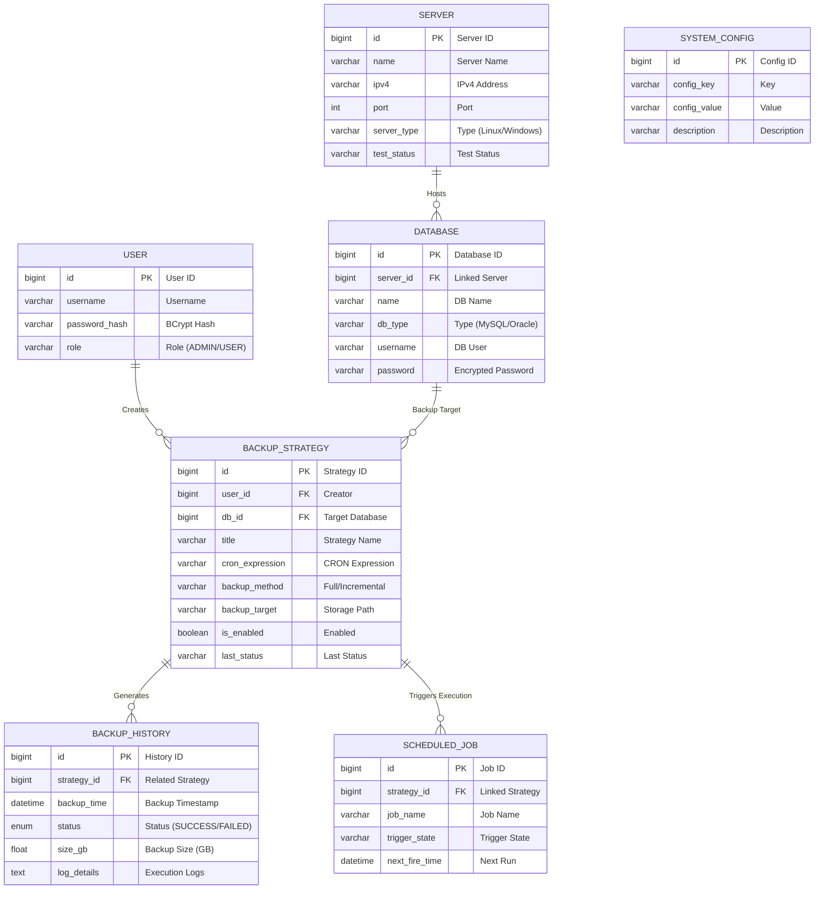

```mermaid
erDiagram
    USER {
        bigint id PK "User ID"
        varchar username "Username"
        varchar password_hash "BCrypt Hash"
        varchar role "Role (ADMIN/USER)"
    }

    SERVER {
        bigint id PK "Server ID"
        varchar name "Server Name"
        varchar ipv4 "IPv4 Address"
        int port "Port"
        varchar server_type "Type (Linux/Windows)"
        varchar test_status "Test Status"
    }

    DATABASE {
        bigint id PK "Database ID"
        bigint server_id FK "Linked Server"
        varchar name "DB Name"
        varchar db_type "Type (MySQL/Oracle)"
        varchar username "DB User"
        varchar password "Encrypted Password"
    }

    BACKUP_STRATEGY {
        bigint id PK "Strategy ID"
        bigint user_id FK "Creator"
        bigint db_id FK "Target Database"
        varchar title "Strategy Name"
        varchar cron_expression "CRON Expression"
        varchar backup_method "Full/Incremental"
        varchar backup_target "Storage Path"
        boolean is_enabled "Enabled"
        varchar last_status "Last Status"
    }

    BACKUP_HISTORY {
        bigint id PK "History ID"
        bigint strategy_id FK "Related Strategy"
        datetime backup_time "Backup Timestamp"
        enum status "Status (SUCCESS/FAILED)"
        float size_gb "Backup Size (GB)"
        text log_details "Execution Logs"
    }

    SCHEDULED_JOB {
        bigint id PK "Job ID"
        bigint strategy_id FK "Linked Strategy"
        varchar job_name "Job Name"
        varchar trigger_state "Trigger State"
        datetime next_fire_time "Next Run"
    }

    SYSTEM_CONFIG {
        bigint id PK "Config ID"
        varchar config_key "Key"
        varchar config_value "Value"
        varchar description "Description"
    }

    USER ||--o{ BACKUP_STRATEGY : "Creates"
    SERVER ||--o{ DATABASE : "Hosts"
    DATABASE ||--o{ BACKUP_STRATEGY : "Backup Target"
    BACKUP_STRATEGY ||--o{ BACKUP_HISTORY : "Generates"
    BACKUP_STRATEGY ||--o{ SCHEDULED_JOB : "Triggers Execution"
```
