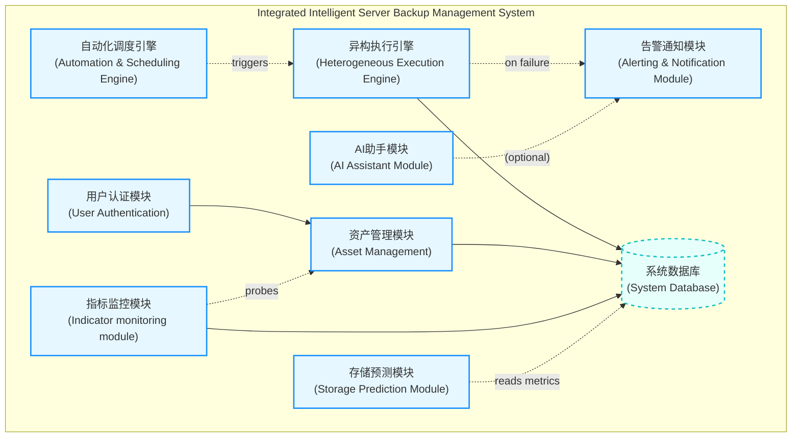

```mermaid
flowchart TB
    subgraph "Integrated Intelligent Server Backup Management System"
        Auth["用户认证模块\n(User Authentication)"]
        Asset["资产管理模块\n(Asset Management)"]
        Scheduler["自动化调度引擎\n(Automation & Scheduling Engine)"]
        Executor["异构执行引擎\n(Heterogeneous Execution Engine)"]
        Monitor["指标监控模块\n(Indicator monitoring module)"]
        Predictor["存储预测模块\n(Storage Prediction Module)"]
        Alerter["告警通知模块\n(Alerting & Notification Module)"]
        AI["AI助手模块\n(AI Assistant Module)"]
        DB[("系统数据库\n(System Database)")]
    end

    Auth --> Asset
    Scheduler -. "triggers" .-> Executor
    Executor -. "on failure" .-> Alerter
    Executor --> DB
    Asset --> DB
    Monitor -. "probes" .-> Asset
    Monitor --> DB
    Predictor -. "reads metrics" .-> DB
    AI -. "(optional)" .-> Alerter

    classDef component fill:#e6f7ff,stroke:#1890ff,stroke-width:2px
    classDef database fill:#e6fffb,stroke:#13c2c2,stroke-width:2px,stroke-dasharray:5
    class Auth,Asset,Scheduler,Executor,Monitor,Predictor,Alerter,AI component
    class DB database

```
