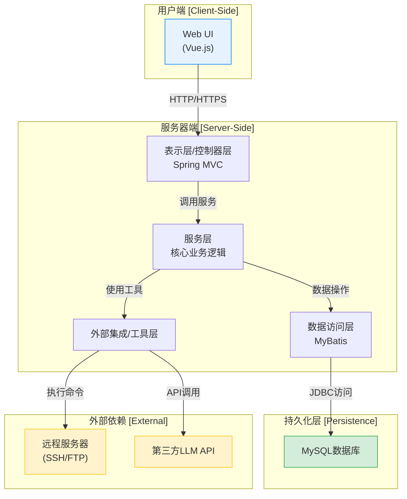

```mermaid
graph TD
    subgraph "用户端 [Client-Side]"
        A["Web UI<br>(Vue.js)"]
    end

    subgraph "服务器端 [Server-Side]"
        B["表示层/控制器层<br>Spring MVC"]
        C["服务层<br>核心业务逻辑"]
        D["外部集成/工具层"]
        E["数据访问层<br>MyBatis"]
    end

    subgraph "持久化层 [Persistence]"
        F["MySQL数据库"]
    end

    subgraph "外部依赖 [External]"
        G["远程服务器<br>(SSH/FTP)"]
        H["第三方LLM API"]
    end

    A -- "HTTP/HTTPS" --> B
    B -- "调用服务" --> C
    C -- "使用工具" --> D
    C -- "数据操作" --> E
    D -- "执行命令" --> G
    D -- "API调用" --> H
    E -- "JDBC访问" --> F

    style A fill:#e6f3ff,stroke:#007bff
    style F fill:#d4edda,stroke:#28a745
    style G fill:#fff3cd,stroke:#ffc107
    style H fill:#fff3cd,stroke:#ffc107

```
